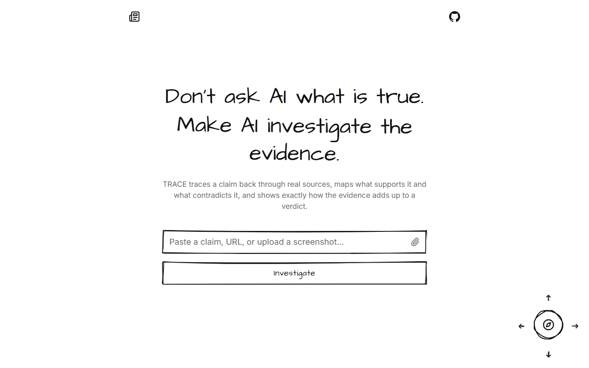
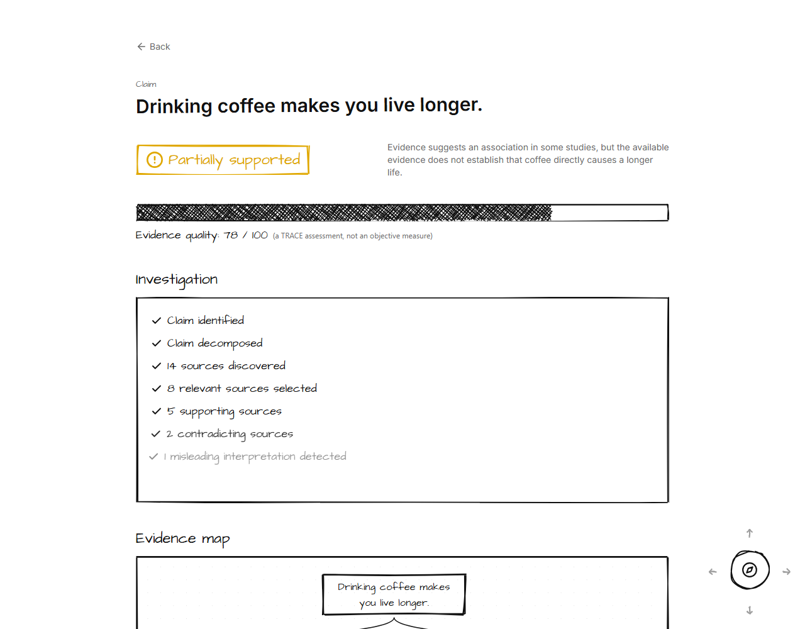
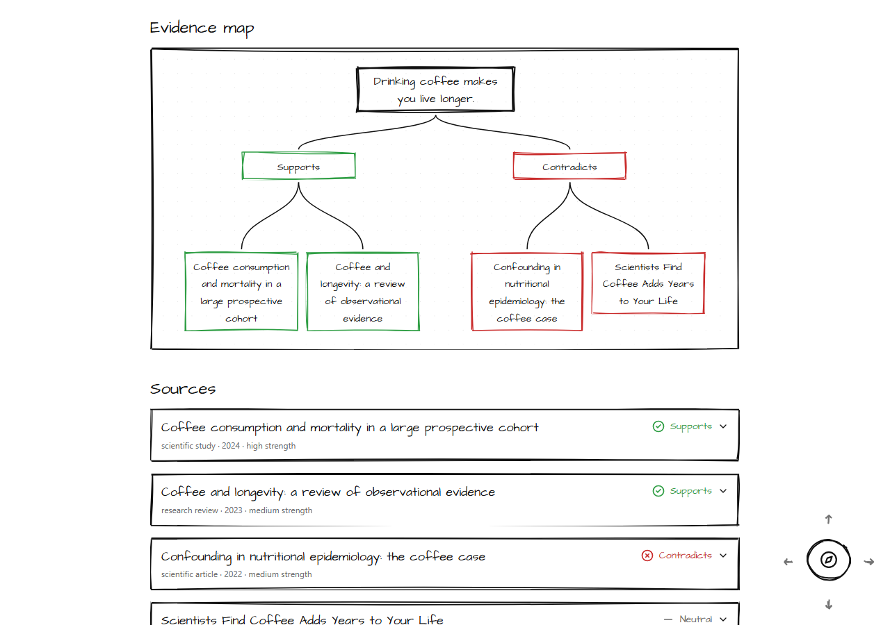
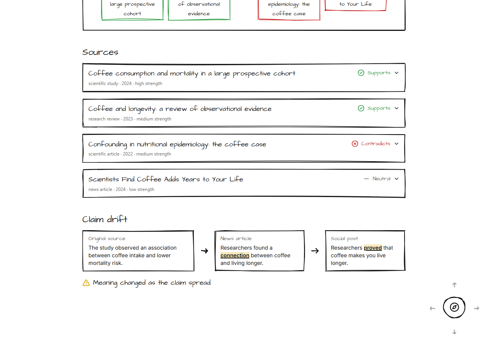
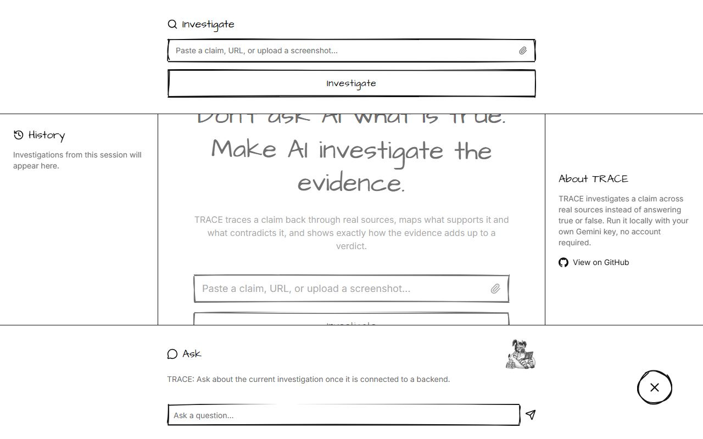
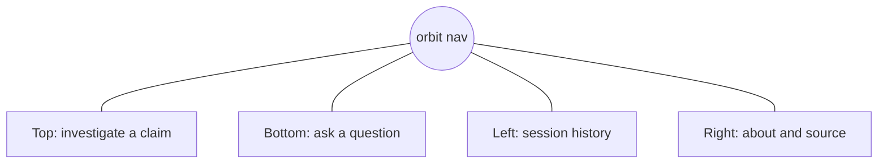
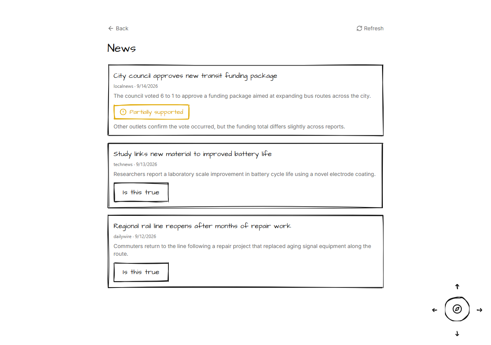
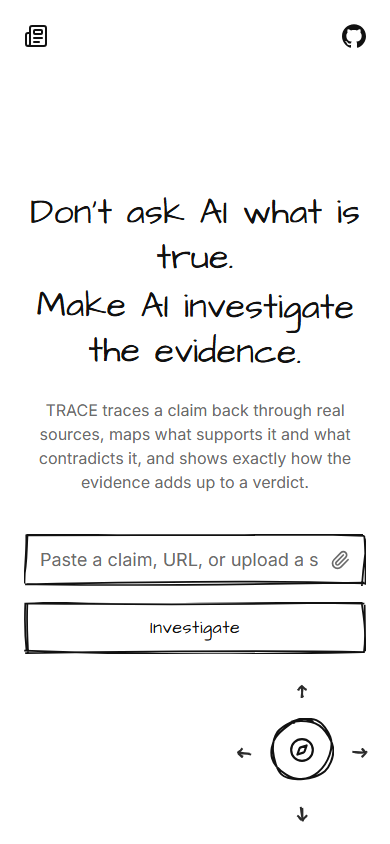
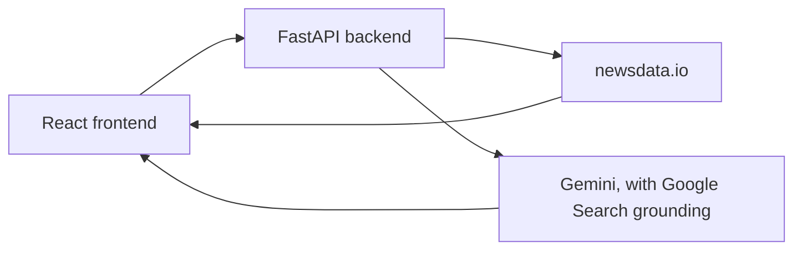

<p align="center">
  
</p>

<h1 align="center">TRACE</h1>
<p align="center"><i>See how claims become truth.</i></p>

<p align="center">
  
  
  
  
</p>

TRACE investigates a claim across real sources instead of answering true or false. It maps what supports a claim and what contradicts it, tracks how the claim's meaning drifted as it spread, and shows exactly how the evidence adds up to a five state verdict.

<p align="center">
  
</p>

## Why it is different

Most fact checking tools return a single true or false answer. TRACE shows its work instead: which sources it found, whether each one actually supports the claim, how the claim's wording changed from the original research to a social post, and a five state verdict (supported, partially supported, misleading, contradicted, insufficient evidence) rather than a binary one. The evidence quality score is explicitly labeled as a TRACE assessment, not an objective measure of truth.

## How an investigation looks

<p align="center">
  
</p>

The evidence map lays the claim, what supports it, and what contradicts it out as a tree, and clicking any source jumps straight to the evidence behind it.

<p align="center">
  
</p>

Claim drift is the signature feature: it lines up the original source against the version that spread, and underlines exactly where the meaning shifted.

<p align="center">
  
</p>

## Navigation

There is no menu bar. A single button sits in the bottom right corner, arrows orbit it to draw the eye, and clicking it opens four docks at once, one per screen edge, each with its own purpose.

<p align="center">
  
</p>



## News

The News page reads live articles through the backend, and an "Is this true" button on any article gets a real Gemini verdict, grounded with Google Search, right then.

<p align="center">
  
</p>

## Built for every screen

<p align="center">
  
</p>

## Architecture



Both API keys stay on the backend, in a `.env` file that is never sent to or read by the browser. The investigation page above still runs on a static mock fixture; the News page and its verdicts are the real backend integration so far.

## Run it locally

TRACE is meant to be run on your own machine with your own keys, not shared as a hosted service.

### 1. Backend

```
cd backend
py -m venv .venv
.venv\Scripts\python.exe -m pip install -r requirements.txt
copy .env.example .env
```

Fill in `backend/.env` with your own keys:

```
NEWSDATA_API_KEY=your newsdata.io key
GEMINI_API_KEY=your Gemini key
GEMINI_MODEL=gemini-3.8-flash
```

Then run it:

```
.venv\Scripts\python.exe -m uvicorn app.main:app --reload --port 8000
```

Each `GET /api/news` call costs one newsdata.io credit for up to ten articles, so the News page only fetches on load and on a manual refresh, never on a timer.

### 2. Frontend

```
npm install
npm run dev
```

The frontend talks to the backend at `http://localhost:8000` by default; set `VITE_API_BASE_URL` if it runs somewhere else. The landing and investigation pages need no backend at all, since they run entirely on the mock investigation.

## Stack

React, TypeScript, Vite, Tailwind CSS, Framer Motion, React Flow (`@xyflow/react`), `roughjs`, `lucide-react` on the frontend; FastAPI, `httpx`, `google-genai` on the backend.

## Design

The whole interface is meant to feel hand drawn rather than corporate: black and white, hand drawn shapes via `roughjs`, a handwriting style display font for headings, and a mascot that shows up in the Ask dock instead of a generic bot icon. The five verdict colors are the one deliberate exception to the black and white rule, used only as small functional accents so severity stays scannable at a glance.
